# CS6620-Final-Project

## Introduction

This project is main focus on exploring the relationship between Covid-19 vaccinations and deaths attributed to Covid-19 in the U.S. between 03/01/21 - 11/30/21 to analyze the effectiveness of the Covid-19 vaccination over time. 

And using Covid-19 vaccination data to learn how to store data in AWS S3 bucket and visualize data by AWS QuickSight.

## Infrastructure Diagram
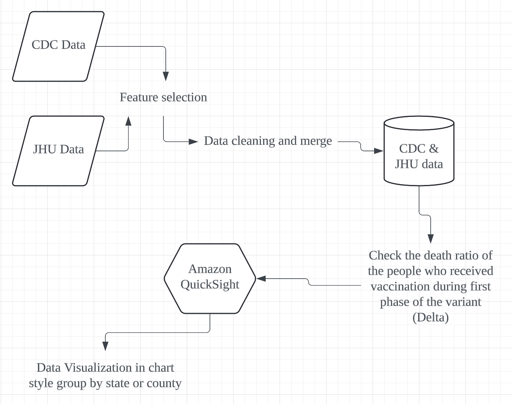

## Data

Data related to the Covid-19 vaccination was sourced from the Center For Disease Control and Prevention (CDC) and data related to Covid-19 deaths was sourced from Johns Hopkins University (JHU).

To begin to assess the effectiveness of the vaccination over time, the % of the vaccinated population over 18 years of age (CDC) is compared to Covid related deaths per 100k (JHU). The data was broken down by each county and state, and a snapshot of data was taken at the of each month to create a more accurate representation. Because the JHU data reflect deaths that accumulate over time, the time series was adjusted to compute the difference in death figures between dates.

**CDC Data**
```
https://data.cdc.gov/Vaccinations/COVID-19-Vaccinations-in-the-United-States-County/8xkx-amqh
``` 

**Johns Hopkins University Data**
```
https://github.com/CSSEGISandData/COVID-19/tree/f57525e860010f6c5c0c103fd97e2e7282b480c8
```

## Processing the data
The CDC data is made available as a single file, updated daily by the CDC since May 24, 2021 (the file contains data about vaccinations beginning in December 2020, though). The JHU data is released daily as well, but each file contains a snapshot of one specific day. Both sources include FIPS codes--when combined with the date information, we can link datasets together to explore our research question.  

Because of the March to November timeframe we wanted to analyze, we focused on data for nine specific dates:
* March 31, 2021
* April 30, 2021
* May 31, 2021
* June 30, 2021
* July 31, 2021
* August 31, 2021
* September 30, 2021
* October 31, 2021
* November 30, 2021

## AWS Platform
Once I have done processing the data, I have uploaded all the csv files into AWS S3 bucket, then import to AWS QuickSight to do the visualization part. Quicksight could accept several data resources The following images shown how to connect data from S3 bucket to QuickSight:
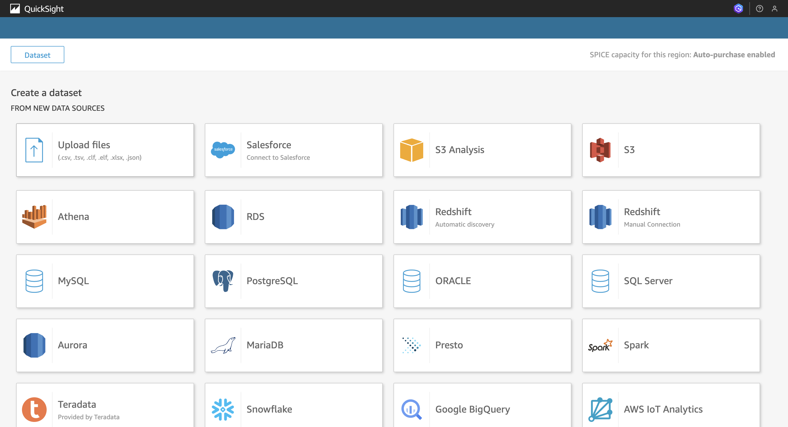
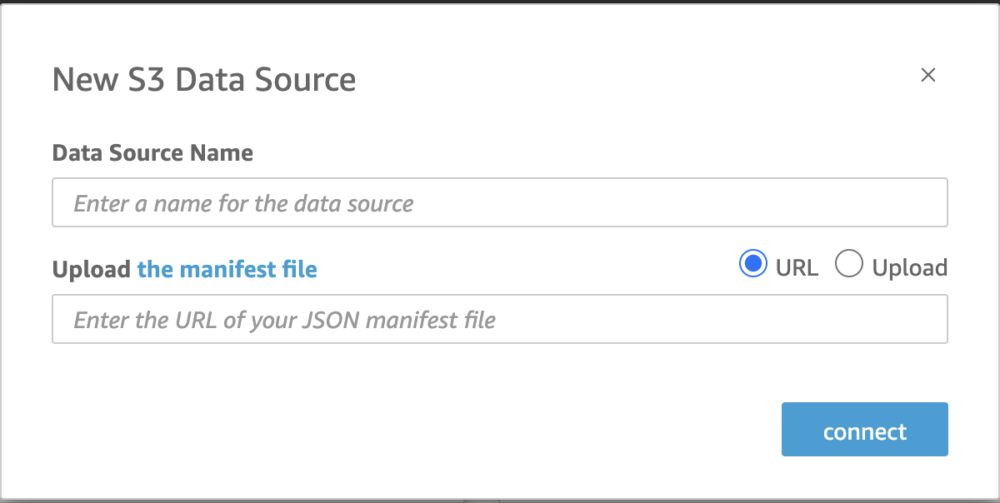


## Output
There are 9 screenshots shown the Deaths group by state level:
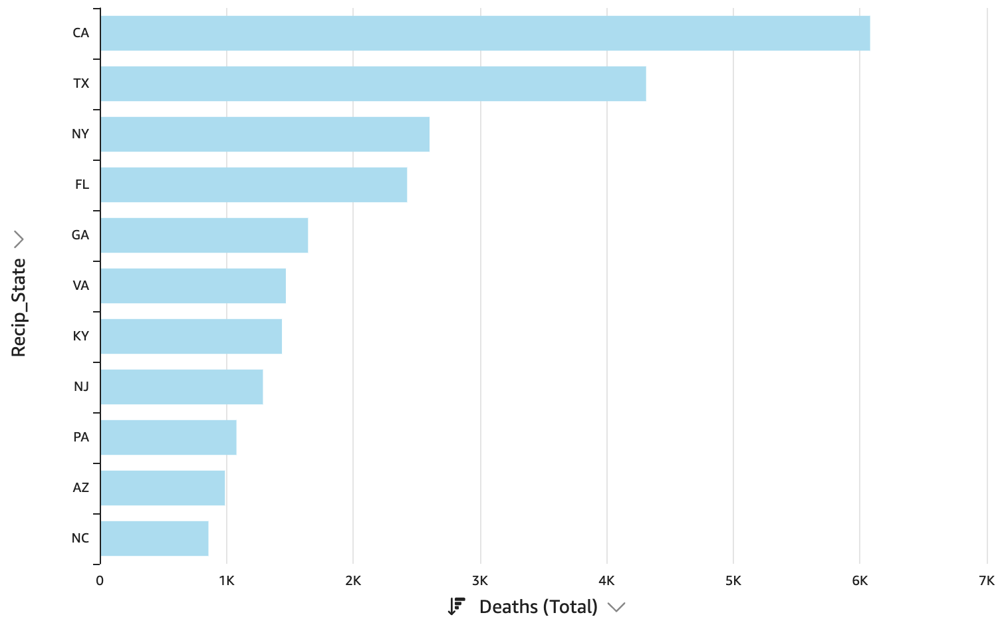
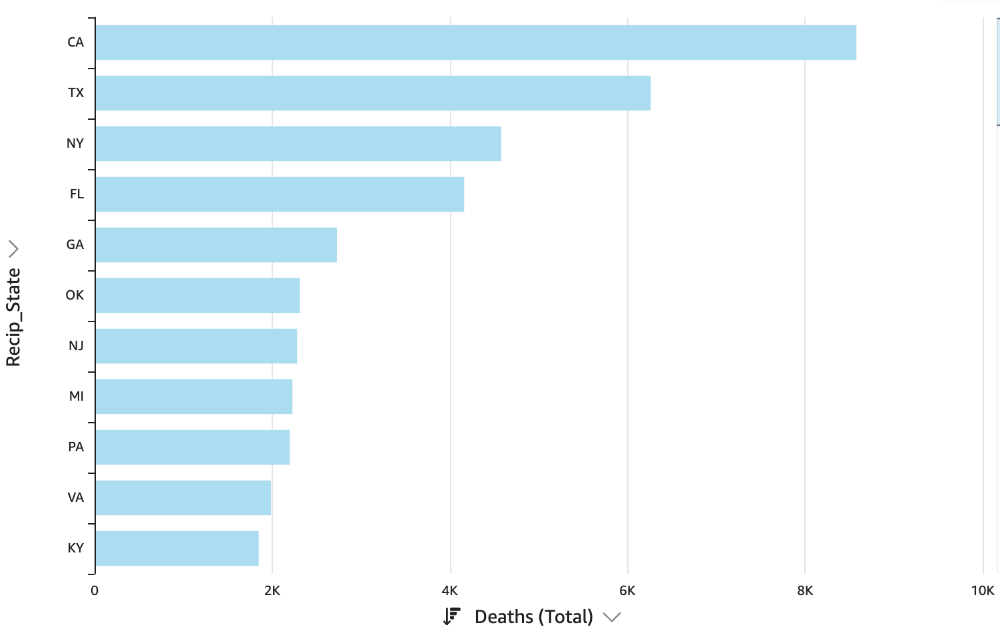
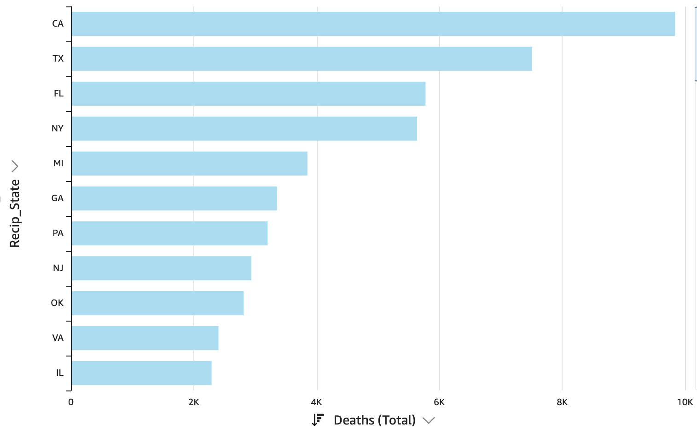
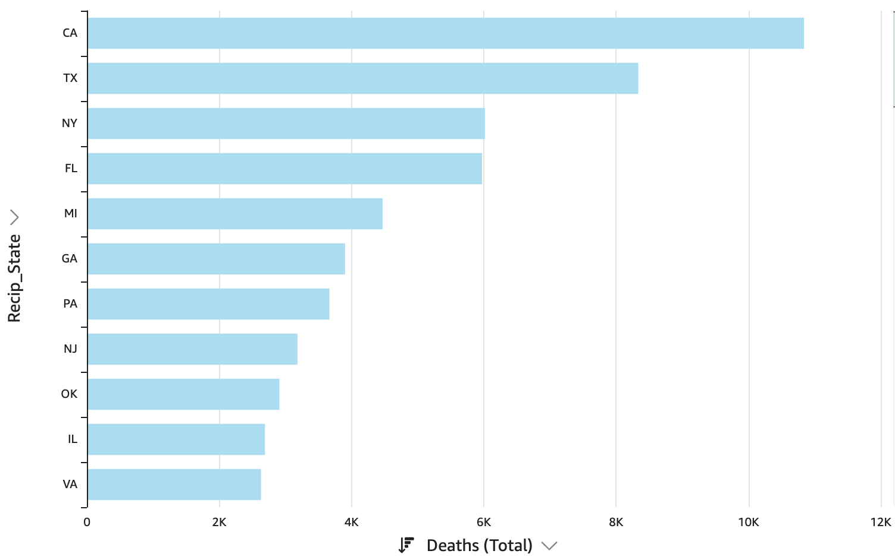
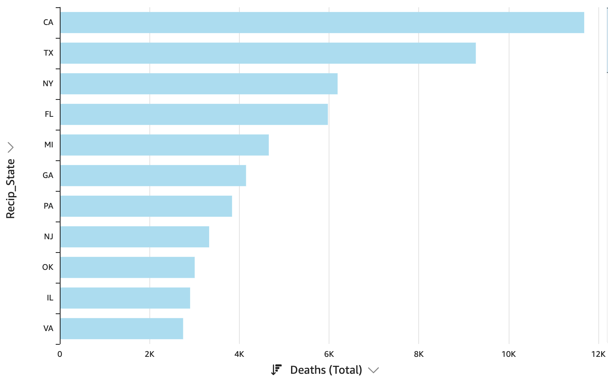
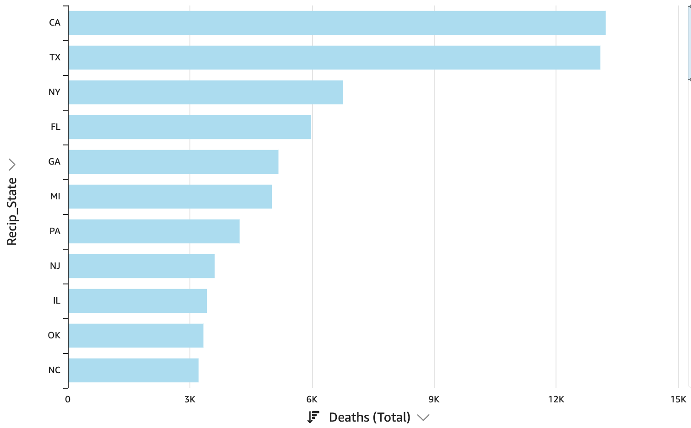
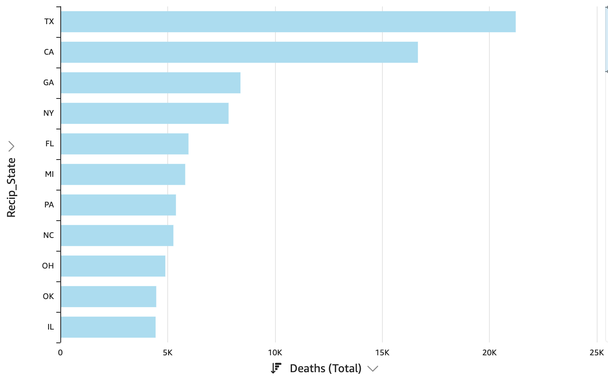
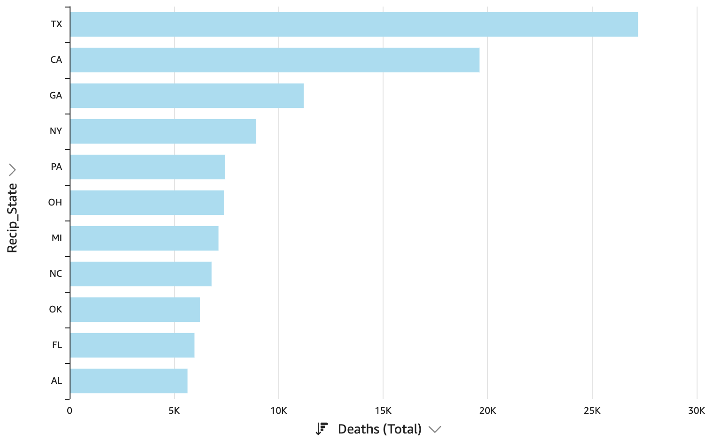
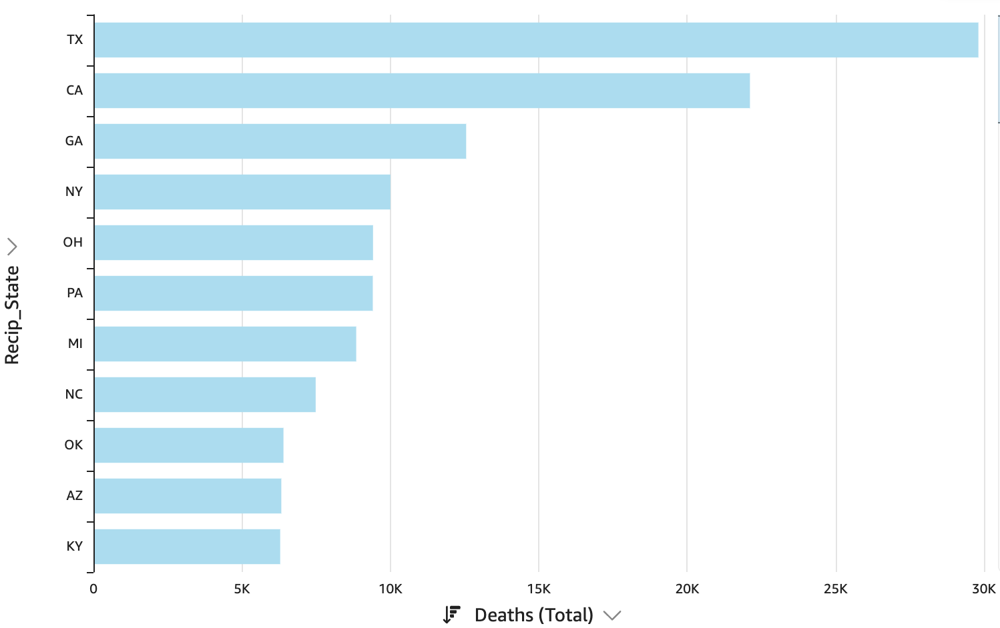

## Future Considerations

**Dataset**  
  * Compare different regions with similar population sizes 
  * Compare individual areas with higher vaccination rates against similar areas with lower vaccination rates
